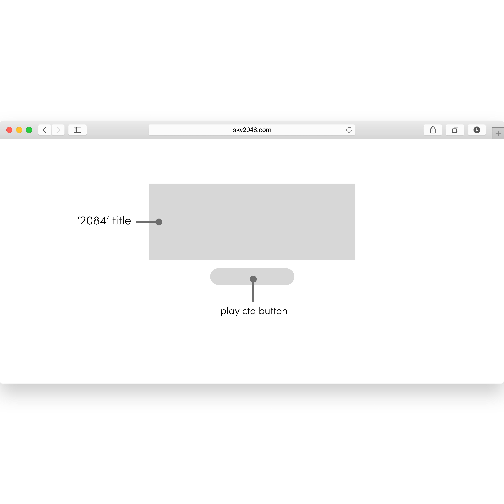
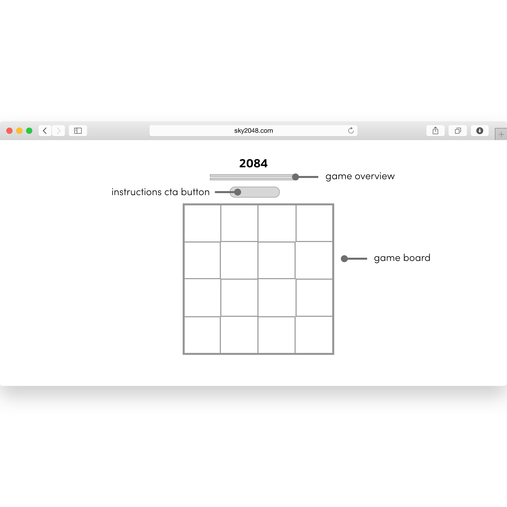

# Project 1 - 2048 Game

This game is a rendition of the ever so favorite single-player mobile game.

### Instructions for Gameplay

The objective of the game is to move the tiles, using the arrow keys, and combine similar values. The goal is to get up to 2048. After that, you have won the game! Game ends when no more possible moves left or if the player achieves to the 2048 tile.

###### Low Fi Wireframes

###### User Story
When the page loads, the user will see the game title, "2048", along with a play button below it. User clicks the button, and the page will load a new page, which includes the game board and an instructions button. As the user hovers over the 'How to Play' button,' there will be a brief instruction on how to able. Whether the user reaches the end goal of getting the tile to be 2048, or the user is out of moves, a dialogue will appear on the bottom of the game board. The message will state whether the user won or lost the game.

### Built With
- HTML/CSS/Javascript
- [jQuery](https://jquery.com/)
- [Animista](http://animista.net/)

### Creator
Sky Yoo, SEI GA LA

### Acknowledgements

This game is originally created by [Gabriele Cirulli](https://play2048.co/).
